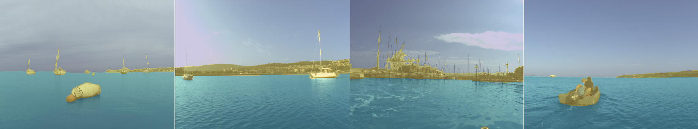
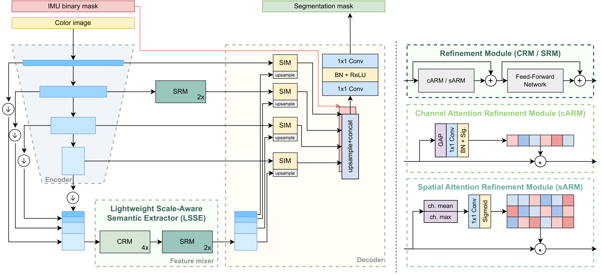

# eWaSR - an embedded-compute-ready maritime obstacle detection network

**[Luxonis](https://luxonis.com), [ViCOS](https://www.vicos.si/)**
 

Matija Teršek, Lojze Žust, Matej Kristan

[[`paper`](https://www.mdpi.com/1424-8220/23/12/5386)] [[`BibTeX`](#citation)] [[`weights`](#pretrained-models)]

The official PyTorch implementation of the **e**mbedded-compute **WaSR (eWaSR)** network [[1](#ref-ewasr)]. Repository contains scripts for training and running the network and weights pretrained on the MaSTr1325 [[2](#ref-mastr)] dataset. 

<p align="center">
    
</p>

## About eWaSR

**eWaSR** is an embedded-compute-ready variant of WaSR [[3](#ref-wasr)], that follows the most recent advancements of transformer-based lightweight networks. Compared to WaSR, iit is able to reduce the inference time by more than 10x at insignificant loss in detection accuracy.

<p align="center">
    
</p>

## Setup

**Requirements**: Python >= 3.6, PyTorch, PyTorch Lightning (for training)

Install the dependencies provided in `requirements.txt`.

```bash
pip install -r requirements.txt
```

## Pretrained models

Currently available pretrained model weights. All models are trained on the MaSTr1325 [[2](#ref-mastr)] dataset.

| model              | backbone   | IMU | url                                                                                       |
|--------------------|------------|-----|-------------------------------------------------------------------------------------------|
| ewasr_resnet18_imu     | ResNet-18  | ✓ | [weights](https://github.com/tersekmatija/eWaSR/releases/tag/0.1.0) |
| ewasr_resnet18     | ResNet-18  |  | [weights](https://github.com/tersekmatija/eWaSR/releases/tag/0.1.0) |

## Export

You can export the pre-trained model to ONNX and blob compatible with OAK-D device.

```
python3 export.py \
--architecture ewasr_resnet18_imu \
--weights-file pretrained/ewasr_resnet18_imu.pth \
--output_dir output
```

Use `--onnx_only` to export only the ONNX file.

## Model training

1. Download and prepare the [MaSTr1325 dataset](https://box.vicos.si/borja/viamaro/index.html#mastr1325) (images and GT masks). If you plan to use the IMU-enabled model also download the IMU masks.
2. Edit the dataset configuration (`configs/mastr1325_train.yaml`, `configs/mastr1325_val.yaml`) files so that they correctly point to the dataset directories.
3. Use the `train.py` to train the network.

```bash
export CUDA_VISIBLE_DEVICES=0,1,2,3 # GPUs to use
python train.py \
--train_config configs/mastr1325_train.yaml \
--val_config configs/mastr1325_val.yaml \
--model_name my_ewasr \
--validation \
--batch_size 4 \
--epochs 50
```

### Model architectures

By default the ResNet-18, IMU-enabled version of the eWaSR is used in training. To select a different model architecture use the `--model` argument. Repository also supports training the models from the official WaSR implementation. Currently implemented model architectures:

| model              | backbone   | IMU |
|--------------------|------------|-----|
| ewasr_resnet18_imu | ResNet-18  | ✓   |
| ewasr_resnet18     | ResNet-18  |     |
| wasr_resnet101_imu | ResNet-101 | ✓   |
| wasr_resnet101     | ResNet-101 |     |
| wasr_resnet50_imu  | ResNet-50  | ✓   |
| wasr_resnet50      | ResNet-50  |     |
| deeplab            | ResNet-101 |     |

### Logging and model weights

A log dir with the specified model name will be created inside the `output` directory. Model checkpoints and training logs will be stored here. At the end of the training the model weights are also exported to a `weights.pth` file inside this directory.

Logged metrics (loss, validation accuracy, validation IoU) can be inspected using tensorboard.

```bash
tensorboard --logdir output/logs/model_name
```

## Model inference

To run model inference using pretrained weights use the `predict.py` script. A sample dataset config file (`configs/examples.yaml`) is provided to run examples from the `examples` directory.

```bash
# export CUDA_VISIBLE_DEVICES=-1 # CPU only
export CUDA_VISIBLE_DEVICES=0 # GPU to use
python predict.py \
--dataset_config configs/examples.yaml \
--model ewasr_resnet18_imu \
--weights path/to/model/weights.pth \
--output_dir output/predictions
```

Predictions will be stored as color-coded masks to the specified output directory.


## Citation

If you use this code, please cite our papers:

```bib
@article{tersek2023ewasr,
  author = {Ter\v{s}ek, Matija and \v{Z}ust, Lojze and Kristan, Matej},
  title = {eWaSR -- An Embedded-Compute-Ready Maritime Obstacle Detection Network},
  journal = {Sensors},
  year = {2023},
  volume = {23},
  number = {12},
  pages = {5386},
  doi = {10.3390/s23125386},
}
```

## References

<a name="ref-ewasr"></a>[1] Teršek, M., Žust, L., Kristan, M. (2023). eWaSR -- an embedded-compute-ready maritime obstacle detection network

<a name="ref-mastr"></a>[2] Bovcon, B., Muhovič, J., Perš, J., & Kristan, M. (2019). The MaSTr1325 dataset for training deep USV obstacle detection models. 2019 IEEE/RSJ International Conference on Intelligent Robots and Systems (IROS)

<a name="ref-wasr"></a>[3] Bovcon, B., & Kristan, M. (2021). WaSR--A Water Segmentation and Refinement Maritime Obstacle Detection Network. IEEE Transactions on Cybernetics

## Code

Code based on the following amazing repositories:
* [WaSR](https://github.com/lojzezust/WaSR)
* [TopFormer](https://github.com/hustvl/TopFormer)
* [PoolFormer](https://github.com/sail-sg/poolformer)

All repositories included are Apache-2.0 licensed. Please refer to each repository for the individual licenses.

## License

This repository, including pre-trained weights, is licensed under Apache-2.0.
